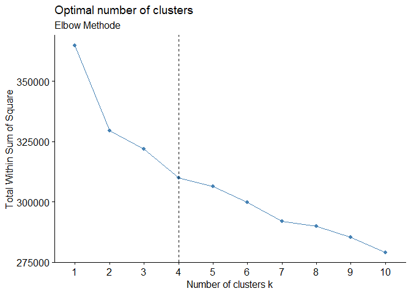
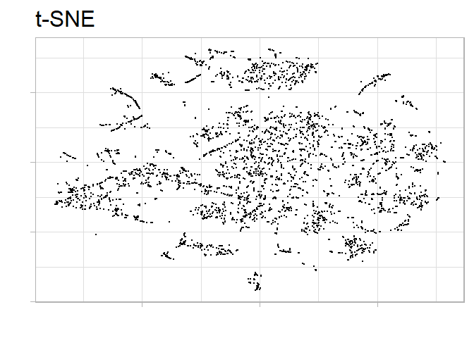
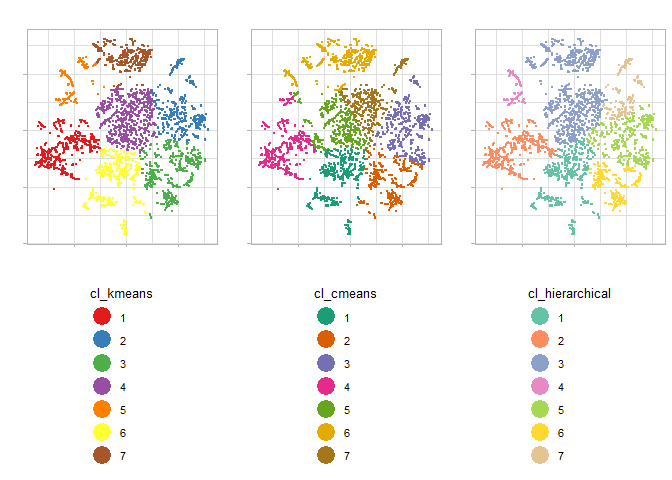

Unsupervised Learning - Clustering und Dimensionsreduktion
================

Librarys laden
--------------

``` r
library(devtools)
library(ggbiplot)
library(tidyverse)
library(ggfortify)
library(broom)
library(dendextend)
library(gridExtra)
library(ggrepel)
library(NbClust)
library(cluster)
library(fpc)
library(factoextra)
library(readxl)
```

Data Import, Data Understanding, Data Cleaning
----------------------------------------------

``` r
sc <- read_csv("~/R 3.5 Files/Projektseminar/R/aps_failure_training_set.csv")
df <- sc
#Daten einlesen

## Untersuchung vom Datensatz------
head(df,5)
```

    ## # A tibble: 5 x 171
    ##   class aa_000 ab_000 ac_000 ad_000 ae_000 af_000 ag_000 ag_001 ag_002
    ##   <chr>  <int> <chr>  <chr>  <chr>  <chr>  <chr>  <chr>  <chr>  <chr> 
    ## 1 neg    76698 na     21307~ 280    0      0      0      0      0     
    ## 2 neg    33058 na     0      na     0      0      0      0      0     
    ## 3 neg    41040 na     228    100    0      0      0      0      0     
    ## 4 neg       12 0      70     66     0      10     0      0      0     
    ## 5 neg    60874 na     1368   458    0      0      0      0      0     
    ## # ... with 161 more variables: ag_003 <chr>, ag_004 <chr>, ag_005 <chr>,
    ## #   ag_006 <chr>, ag_007 <chr>, ag_008 <chr>, ag_009 <chr>, ah_000 <chr>,
    ## #   ai_000 <chr>, aj_000 <chr>, ak_000 <chr>, al_000 <chr>, am_0 <chr>,
    ## #   an_000 <chr>, ao_000 <chr>, ap_000 <chr>, aq_000 <chr>, ar_000 <chr>,
    ## #   as_000 <chr>, at_000 <chr>, au_000 <chr>, av_000 <chr>, ax_000 <chr>,
    ## #   ay_000 <chr>, ay_001 <chr>, ay_002 <chr>, ay_003 <chr>, ay_004 <chr>,
    ## #   ay_005 <chr>, ay_006 <chr>, ay_007 <chr>, ay_008 <chr>, ay_009 <chr>,
    ## #   az_000 <chr>, az_001 <chr>, az_002 <chr>, az_003 <chr>, az_004 <chr>,
    ## #   az_005 <chr>, az_006 <chr>, az_007 <chr>, az_008 <chr>, az_009 <chr>,
    ## #   ba_000 <chr>, ba_001 <chr>, ba_002 <chr>, ba_003 <chr>, ba_004 <chr>,
    ## #   ba_005 <chr>, ba_006 <chr>, ba_007 <chr>, ba_008 <chr>, ba_009 <chr>,
    ## #   bb_000 <chr>, bc_000 <chr>, bd_000 <chr>, be_000 <chr>, bf_000 <chr>,
    ## #   bg_000 <chr>, bh_000 <chr>, bi_000 <chr>, bj_000 <chr>, bk_000 <chr>,
    ## #   bl_000 <chr>, bm_000 <chr>, bn_000 <chr>, bo_000 <chr>, bp_000 <chr>,
    ## #   bq_000 <chr>, br_000 <chr>, bs_000 <chr>, bt_000 <chr>, bu_000 <chr>,
    ## #   bv_000 <chr>, bx_000 <chr>, by_000 <chr>, bz_000 <chr>, ca_000 <chr>,
    ## #   cb_000 <chr>, cc_000 <chr>, cd_000 <chr>, ce_000 <chr>, cf_000 <chr>,
    ## #   cg_000 <chr>, ch_000 <chr>, ci_000 <chr>, cj_000 <chr>, ck_000 <chr>,
    ## #   cl_000 <chr>, cm_000 <chr>, cn_000 <chr>, cn_001 <chr>, cn_002 <chr>,
    ## #   cn_003 <chr>, cn_004 <chr>, cn_005 <chr>, cn_006 <chr>, cn_007 <chr>,
    ## #   cn_008 <chr>, cn_009 <chr>, ...

``` r
nrow(df)
```

    ## [1] 60000

``` r
#60.000 Zeilen 
ncol(df)
```

    ## [1] 171

``` r
#171 Spalten
count(df, vars = class)
```

    ## # A tibble: 2 x 2
    ##   vars      n
    ##   <chr> <int>
    ## 1 neg   59000
    ## 2 pos    1000

``` r
#59.000 negative Klassen
#1.000 positive Klassen
#Ergebnis: Ziemlich unbalanciertes Verhältnis von positiven und negativen Klassen
#----------------------------------

df <- df %>%
 mutate(class = if_else(class == "pos", 0,1))
#Variable Class numerisch machen
df <- as.data.frame(lapply(df, as.numeric))
#Dataframe als numeric speichern

## NA ersetzen
df[ df == "na" ] <- NA
#NA als String gespeichert -> ersetzen durch richtiges NA
for(i in 1:ncol(df)){
  df[is.na(df[,i]), i] <- median(df[,i], na.rm = TRUE)
}
#NA mit Median ersetzen
df <- na.omit(df)
#Löschen von NA -> überprüfen ob alle NA weg sind

#cd_000 -> Varianz von 0 also entfernen
df <- select(df,-cd_000)

#---------------
class_pred <- df$class
df_ohneClass <- select(df,-class)

df.scaled <- scale(df_ohneClass)
df.scaled <- cbind(class_pred, df.scaled)
#Daten außer class scalen
#----------------


#Korrelationsmatrix-----------------------
library(corrplot)
library(caret)

corMatrix <- cor(df.scaled)
#Daten skalieren und Korrelationsmatrix berechnen
corrplot(corMatrix, order = "hclust", cl.pos = "n", tl.pos = "n")
```


``` r
#Visualisieren --> Viele Features mit hoher Korrelation

highlyCor <- findCorrelation(corMatrix, 0.70)
#Herausfinden welche Features eine höhere Korrelation von 0.7 haben und diese entfernen
df.scaled.filter <- df.scaled[,-highlyCor]
df <- df[,-highlyCor]

#Wieder Korrelationsmatrix bilden und visualisieren
corMatrix <- cor(df.scaled.filter)
corrplot(corMatrix, order = "hclust", tl.pos = "n")
```


``` r
remove(corMatrix)
remove(df.scaled)
remove(df.scaled.filter)
#Datensatz von 171 auf 92 Variablen reduziert
#----------------------------------------

#Ausgeglichenen Datensatz bilden
df1 <- filter(df, class == 1)
df0 <- filter(df, class == 0)

set.seed(123345); ss2 <- sample(1:59000, 3000)

df1_new <- df1[ss2, ]

df_new_original <- rbind(df1_new,df0)
df_new <- rbind(df1_new,df0)

remove(ss2)
#Hier jetzt ein balancierten Dataframe gemacht -> 0,25 % negative Klassen und 0,75 % positive Klassen
#-------------------------

#Diesen neuen balancierten Dataframe jetz wieder skalieren
class_pred <- df_new$class
df_new <- select(df_new,-class)
df_new <- scale(df_new)
df_new <- cbind(class_pred, df_new)

y <- df_new
y[is.nan(y)] <- 0
df_new <- y
remove(y)

which(apply(df_new, 2, var)==0)
```

    ## named integer(0)

``` r
df_new <- df_new[ , apply(df_new, 2, var) != 0]
#--------------------------------------
```

Optimale Clustermenge
---------------------

``` r
library(factoextra)

#Optimale Menge an Cluster
fviz_nbclust(df_new, kmeans, method = "wss") +
  geom_vline(xintercept = 4, linetype = 2) + labs(subtitle = "Elbow Methode")
```



Modelling K-Means
-----------------

``` r
library(factoextra)

set.seed(1111)
km.res <- kmeans(df_new, 4, nstart = 50)
#Kmenas Algorithmus laufen mit 5 Clustern und 50 Startinitalisierungen

#Cluster an den neuen Datensatz anhängen (wie mutate)
dd <- cbind(df, cluster = km.res$cluster)


#Das hier zieht automatisch PCA
fviz_cluster(km.res, data = df_new,
             palette = c("#2E9FDF", "#1a4710", "#E7B800", "#FC4E07","#A4C48D", "#551a8b", "#909090"),
             ellipse.type = "euclid", # Concentration ellipse
             #star.plot = TRUE, # Add segments from centroids to items
             #repel = TRUE, # Avoid label overplotting (slow)
             show.clust.cent = TRUE,
             labelsize = 0,
             main = "K-Means mit k=5",
             outlier.color = "black",
             xlab = FALSE,
             ylab = FALSE,
             legend = "bottom",
             ggtheme = theme_minimal()
)
```


``` r
table(df_new_original$class, km.res$cluster)
```

    ##    
    ##        1    2    3    4
    ##   0  278  171  391  160
    ##   1   31   14 2948    7

Fuzzy C-Means
=============

``` r
library(ppclust)
set.seed(123)
res.fcm <- fcm(df_new, centers=4)
#C-Means

res.fcm2 <- ppclust2(res.fcm, "kmeans")
#Die Ergebnisse mit ppclust2 konvertieren, sodass es von factoextra package gelesen werden kann

cm5 <- fviz_cluster(res.fcm2, data = df_new,
             palette = c("#2E9FDF", "#1a4710", "#E7B800", "#FC4E07","#A4C48D", "#551a8b", "#909090"),
             ellipse.type = "euclid", # Concentration ellipse
             #star.plot = TRUE, # Add segments from centroids to items
             #repel = TRUE, # Avoid label overplotting (slow)
             show.clust.cent = TRUE,
             labelsize = 0,
             outlier.color = "black",
             main = "Fuzzy C-Means mit c=5",
             xlab = FALSE,
             ylab = FALSE,
             legend = "bottom",
             ggtheme = theme_minimal()
)
cm5
```


``` r
table(df_new_original$class, res.fcm2$cluster)
```

    ##    
    ##        1    2    3    4
    ##   0   61  264  471  204
    ##   1 1895   32   39 1034

TSNE
====

``` r
library(Rtsne)

colors = rainbow(length(unique(df_new_original$class)))
names(colors) = unique(df_new_original$class)

df_new2 <- unique(df_new)
df_new_original2 <- unique(df_new_original)

set.seed(5555)
tsne <- Rtsne(df_new2, dims = 2, perplexity=20, verbose=TRUE, max_iter = 500)
```

    ## Read the 3954 x 50 data matrix successfully!
    ## Using no_dims = 2, perplexity = 20.000000, and theta = 0.500000
    ## Computing input similarities...
    ## Normalizing input...
    ## Building tree...
    ##  - point 0 of 3954
    ## Done in 1.03 seconds (sparsity = 0.023599)!
    ## Learning embedding...
    ## Iteration 50: error is 89.348580 (50 iterations in 2.68 seconds)
    ## Iteration 100: error is 75.823100 (50 iterations in 1.68 seconds)
    ## Iteration 150: error is 74.001333 (50 iterations in 1.69 seconds)
    ## Iteration 200: error is 73.437240 (50 iterations in 1.75 seconds)
    ## Iteration 250: error is 73.158037 (50 iterations in 1.74 seconds)
    ## Iteration 300: error is 2.146049 (50 iterations in 1.64 seconds)
    ## Iteration 350: error is 1.715775 (50 iterations in 1.65 seconds)
    ## Iteration 400: error is 1.497784 (50 iterations in 1.70 seconds)
    ## Iteration 450: error is 1.373928 (50 iterations in 1.67 seconds)
    ## Iteration 500: error is 1.297615 (50 iterations in 1.68 seconds)
    ## Fitting performed in 17.88 seconds.

``` r
#Modelling


d_tsne_1 = as.data.frame(tsne$Y)
#Koordinaten speichern

ggplot(d_tsne_1, aes(x=V1, y=V2)) +  
  geom_point(size=0.25) +
  guides(colour=guide_legend(override.aes=list(size=6))) +
  xlab("") + ylab("") +
  ggtitle("t-SNE") +
  theme_light(base_size=20) +
  theme(axis.text.x=element_blank(),
        axis.text.y=element_blank()) +
  scale_colour_brewer(palette = "Set2")
```



``` r
#Visualisieren
#--------------------
```

Modelling auf t-SNE Daten
=========================

``` r
set.seed(12345)
d_tsne_1_original = d_tsne_1

fit_cluster_kmeans=kmeans(scale(d_tsne_1), 7, nstart = 50)  
d_tsne_1_original$cl_kmeans = factor(fit_cluster_kmeans$cluster)

#Hierarchical Clustering
fit_cluster_hierarchical=hclust(dist(scale(d_tsne_1)))
d_tsne_1_original$cl_hierarchical = factor(cutree(fit_cluster_hierarchical, k=7)) 
##C-Means
fit_cluster_cmeans=fcm(scale(d_tsne_1), centers=7)
d_tsne_1_original$cl_cmeans = factor(fit_cluster_cmeans$cluster)
fit_cluster_cmeans2 <- ppclust2(fit_cluster_cmeans, "kmeans")

#Visualisieren
plot_cluster=function(data, var_cluster, palette)  
{
  ggplot(data, aes_string(x="V1", y="V2", color=var_cluster)) +
  geom_point(size=0.25) +
  guides(colour=guide_legend(override.aes=list(size=6))) +
  xlab("") + ylab("") +
  ggtitle("") +
  theme_light(base_size=10) +
  theme(axis.text.x=element_blank(),
        axis.text.y=element_blank(),
        legend.direction = "vertical", 
        legend.position = "bottom",
        legend.box = "vertical") + 
    scale_colour_brewer(palette = palette) 
}


plot_k=plot_cluster(d_tsne_1_original, "cl_kmeans", "Set1")  
plot_h=plot_cluster(d_tsne_1_original, "cl_hierarchical", "Set2")
plot_c=plot_cluster(d_tsne_1_original, "cl_cmeans", "Dark2")


library(gridExtra)  
grid.arrange(plot_k, plot_c, plot_h, ncol=3) 
```



``` r
table(df_new_original2$class, fit_cluster_cmeans2$cluster)
```

    ##    
    ##       1   2   3   4   5   6   7
    ##   0  34 388 483   2   7  10  44
    ##   1 550  85 130 601 565 603 452

``` r
table(df_new_original2$class, fit_cluster_kmeans$cluster)
```

    ##    
    ##       1   2   3   4   5   6   7
    ##   0   1 349 513  26   4  60  15
    ##   1 631 210 104 808 257 546 430

``` r
table(df_new_original2$class, d_tsne_1_original$cl_hierarchical)
```

    ##    
    ##        1    2    3    4    5    6    7
    ##   0   76    4   28    3  455  286  116
    ##   1  579  670 1244  162  121   51  159
