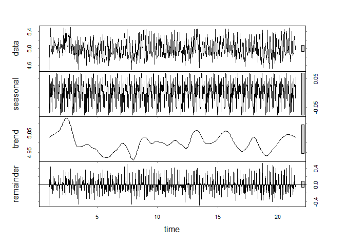

Sales Forecast
================

Librarys laden & Datensatz einlesen
-----------------------------------

``` r
library(tidyverse)
library(readxl)
library(prophet)
library(data.table)
library(dplyr)
library(ggplot2)
library(scales)
library(Metrics)
library(MLmetrics)
library(forecast)
library('tseries')


data <- read.csv("~/R 3.5 Files/data.csv")
```

EDA
---

``` r
#Übersicht
#head(data, n =2)
#895227 Zeilen
nrow(data)
```

    ## [1] 895227

``` r
#11 Spalten
ncol(data)
```

    ## [1] 11

EDA
---

``` r
#Filter auf Filiale
df7 <- data %>%
  filter(KundenNr == "7")

#Aggregieren auf Artikelgruppe und verkaufte Einheiten
ag <- aggregate(df7$VerkaufteMenge, by=list(ArtikelGruppe=df7$Artikelgruppe), FUN=sum)
ag$x <- as.numeric(ag$x)
ag$ArtikelGruppe <- as.factor(ag$ArtikelGruppe)

#Plotten der Verkaufszahlen
ggplot(ag, aes(ArtikelGruppe)) + 
  geom_bar(aes(weight = x), colour="black") + coord_flip() +
  labs(title = "Verkaufszahlen der Artikelgruppen") +
  ylab("Verkaufte Einheiten") + theme_classic() +
  theme(axis.title.x=element_blank(),
        axis.text.x=element_blank(),
        axis.text.y=element_blank(),
        axis.ticks.x=element_blank())
```


Produkte zusammenfassen
-----------------------

``` r
v <- c("1525","4129")

df <- df7 %>%
 filter(ArtNr %in% v)

#aggregieren
ag <- aggregate(df$VerkaufteMenge, by=list(ds=df$Datum), FUN=sum)
gg <- aggregate(df$GelieferteMenge, by=list(ds=df$Datum), FUN=sum)

df <- ag
df$cap <- gg$x
colnames(df) <- c("ds","y","cap")

#Datentyp festlegen
df$ds <- as.Date(df$ds)
df$y <- as.numeric(df$y)
df$cap <- as.numeric(df$cap)

#sortieren
df <- df[order(as.Date(df$ds)),]
```

EDA - Monatliche Verkaufszahlen
-------------------------------

Sowohl 2017 als auch 2018 werden im Februar sehr viele Produkte verkauft. März bis Juni vergleichsweise wenig.

``` r
eda <- df %>%
  mutate(Date = format(as.Date(df$ds), "%Y-%m"))

eda <- aggregate(eda$y, by=list(ds=eda$Date), FUN=sum)
eda$ds <- paste(eda$ds, "01", sep = "-")

eda$x <- as.numeric(eda$x)
eda$ds <- as.Date(eda$ds)

colnames(eda) <- c("ds","y")

ggplot(eda, aes(x=ds, y=y)) +
  geom_point() +
  geom_line() +
  labs(title = "Monatliche Verkaufszahlen") +
  scale_x_date(date_breaks="1 month", date_labels="%Y %m") +
  theme(axis.text.x = element_text(angle = 30, hjust = 1),
        axis.text.y=element_blank())
```


EDA - Verkaufszahlen nach Wochentagen
-------------------------------------

Es ist deutlich zu erkennen, dass am Wochenende mehr verkauft wird als Werktags. Donnerstag scheint der vermeintlich schlechteste Tag zu sein.

Es sind zudem einige Ausreißer zu erkennen.

``` r
df_days <- df %>%
  mutate(wd =  weekdays(as.Date(df$ds)))

ggplot(df_days, aes(x=ds, y=y)) +
  geom_point(aes(colour = factor(wd))) +
   theme(axis.text.y=element_blank())
```


EDA - Tägliche Daten
--------------------

-Ausreißer unterhalb bzw. oberhalb des 2% bzw. 98% Quantils werden entfernt -Tägliche Daten werden im Zeitverlauf geplottet

``` r
#Startdatum
min(df$ds)
```

    ## [1] "2017-01-02"

``` r
#Enddatum
max(df$ds)
```

    ## [1] "2018-10-31"

``` r
#Auch hier sind die Ausreißer zu erkennen -> Ansonsten sind die Werte recht stabil um den Median
#summary(df$y)

#quantile(df$y, probs = c(0.02, 0.98))

q1 <- as.numeric(quantile(df$y, 0.02))
q2 <- as.numeric(quantile(df$y, 0.98))

ggplot(df, aes(x=ds, y = y)) + 
  geom_line() + 
  theme(axis.title.y=element_blank(),
        axis.text.y=element_blank(),
        axis.ticks.y=element_blank())
```


Preprocessing
-------------

-Filtern -Logarithmieren

``` r
#Filter auf 98% Quantil
df <- df %>%
  filter(y <= q2)

#Filter auf 2% Quantil
df <- df %>%
  filter(y >= q1)


#Werte werden logarithmiert, da sehr hohe Schwankungen 
df$y <- log(df$y)

df <- df %>%
  filter(y != -Inf)

#Anzahl an Tagen, die predicted werden sollen
l <- nrow(df) - 90
```

1. Facebook Prophet Modell
--------------------------

``` r
#Train-Test Split
df_wc <- select(df, ds, y)
train_wc <- df_wc[(1:l),]


m = prophet(train_wc, changepoint.prior.scale = 0.9, yearly.seasonality = TRUE, weekly.seasonality = TRUE, daily.seasonality = TRUE)
```

    ## Initial log joint probability = -2.9323
    ## Optimization terminated normally: 
    ##   Convergence detected: relative gradient magnitude is below tolerance

``` r
future = as.data.frame(df$ds)
colnames(future) <- c("ds")
tail(future)
```

    ##             ds
    ## 611 2018-10-26
    ## 612 2018-10-27
    ## 613 2018-10-28
    ## 614 2018-10-29
    ## 615 2018-10-30
    ## 616 2018-10-31

``` r
forecast = predict(m, future)

plot(m, forecast) + add_changepoints_to_plot(m)
```


``` r
prophet_plot_components(m, forecast)
```


Evaluation
----------

``` r
#Das entstandene Forecastingobjekt in gewünschte Form bringen

val <- as.data.frame(forecast$yhat)
val <- cbind(val, df$y)
colnames(val) <- c("pred","actual")
val$pred <- exp(val$pred)
val$actual <- exp(val$actual)

val <- val %>%
  mutate(diff = pred - actual )

val <- val %>%
  mutate(diff_pos = abs(diff))

test <- val[-(1:l),]

Abw_prozent <- percent((sum(test$pred) - sum(test$actual)) / sum(test$actual))

Modell_1 <- c("Prophet",Abw_prozent, rmse(test$actual, test$pred), mase(test$actual, test$pred), MAPE(test$pred, test$actual), MAE(test$pred, test$actual))
```

Carrying Capacity
-----------------

-Facebook Prophet wird eine Carrying Capacity übergeben (natürliche Wachstumsgrenze)

``` r
#Künstlich hochsetzen
df$cap <- df$cap + 70
df$cap <- log(df$cap)
df <- df %>%
  filter(cap != -Inf)
```

2. Facebook Prophet Modell mit Carrying Capacity
------------------------------------------------

``` r
train_mc <- df[(1:l),]

#Jetzt logistisches Wachstum
m = prophet(train_mc, growth = 'logistic', changepoint.prior.scale = 0.9, yearly.seasonality = TRUE, weekly.seasonality = TRUE, daily.seasonality = TRUE)
```

    ## Initial log joint probability = -2.77202
    ## Optimization terminated normally: 
    ##   Convergence detected: relative gradient magnitude is below tolerance

``` r
future = as.data.frame(df$ds)
colnames(future) <- c("ds")
future <- cbind(future, df$cap)
tail(future)
```

    ##             ds   df$cap
    ## 611 2018-10-26 5.598422
    ## 612 2018-10-27 5.736572
    ## 613 2018-10-28 5.799093
    ## 614 2018-10-29 5.438079
    ## 615 2018-10-30 5.438079
    ## 616 2018-10-31 5.438079

``` r
colnames(future) <- c("ds","cap")
forecast = predict(m, future)

plot(m, forecast) + add_changepoints_to_plot(m)
```


``` r
prophet_plot_components(m, forecast)
```


Evaluation
----------

``` r
val <- as.data.frame(forecast$yhat)
val <- cbind(val, df$y)
colnames(val) <- c("pred","actual")
val$pred <- exp(val$pred)
val$actual <- exp(val$actual)

val <- val %>%
  mutate(diff = pred - actual )

val <- val %>%
  mutate(diff_pos = abs(diff))

test <- val[-(1:l),]

Abw_prozent <- percent((sum(test$pred) - sum(test$actual)) / sum(test$actual))

Modell_2 <- c("Prophet_cc",Abw_prozent, rmse(test$actual, test$pred), mase(test$actual, test$pred), MAPE(test$pred, test$actual), MAE(test$pred, test$actual))
```

Holidays zusätzlich einfügen
----------------------------

Dem Prophet Objekt kann zusätzlich ein Holidayvektor übergeben werden

``` r
library(dplyr)
NachSilvester <- data_frame(
  holiday = 'NachSilvester',
  ds = as.Date(c(seq(as.Date("2017-01-02"), as.Date("2017-01-08"), "days"),  seq(as.Date("2018-01-02"), as.Date("2018-01-07"), "days") ,  seq(as.Date("2019-01-02"), as.Date("2019-01-06"), "days"))),
  lower_window = -1,
  upper_window = 1
)

Weihnachten <- data_frame(
  holiday = 'Weihnachten',
  ds = as.Date(c(seq(as.Date("2017-12-22"), as.Date("2017-12-26"), "days"))),
  lower_window = -1,
  upper_window = 1
)

Fasnet <- data_frame(
  holiday = 'Fasnet',
  ds = as.Date(c(seq(as.Date("2017-2-23"), as.Date("2017-03-01"), "days"),  seq(as.Date("2018-02-08"), as.Date("2018-02-14"), "days") ,  seq(as.Date("2019-02-28"), as.Date("2019-03-06"), "days"))),
  lower_window = -1,
  upper_window = 0
)

Herbstferien <- data_frame(
  holiday = 'Herbstferien',
  ds = as.Date(c(seq(as.Date("2017-10-30"), as.Date("2017-11-03"), "days"),  seq(as.Date("2018-10-29"), as.Date("2018-11-02"), "days") ,  seq(as.Date("2019-10-28"), as.Date("2019-10-30"), "days"))),
  lower_window = -2,
  upper_window = 2
)

Sommerferien <- data_frame(
  holiday = 'Sommerferien',
  ds = as.Date(c(seq(as.Date("2017-07-27"), as.Date("2017-09-09"), "days"),  seq(as.Date("2018-07-26"), as.Date("2018-09-08"), "days") ,  seq(as.Date("2019-07-29"), as.Date("2019-09-10"), "days"))),
  lower_window = -1,
  upper_window = 1
)

Osterferien <- data_frame(
  holiday = 'Osterferien',
  ds = as.Date(c(seq(as.Date("2017-04-10"), as.Date("2017-04-21"), "days"),  seq(as.Date("2018-03-26"), as.Date("2018-04-06"), "days") ,  seq(as.Date("2019-04-15"), as.Date("2019-04-27"), "days"))),
  lower_window = -2,
  upper_window = 2
)

Pfingstferien <- data_frame(
  holiday = 'Pfingstferien',
  ds = as.Date(c(seq(as.Date("2017-06-06"), as.Date("2017-06-16"), "days"),  seq(as.Date("2018-05-22"), as.Date("2018-06-02"), "days") ,  seq(as.Date("2019-06-11"), as.Date("2019-06-21"), "days"))),
  lower_window = -2,
  upper_window = 2
)

holidays <- bind_rows(NachSilvester, Weihnachten, Fasnet, Sommerferien, Osterferien, Pfingstferien, Herbstferien)
```

3. Facebook Prophet Modell mit Holidays
---------------------------------------

``` r
train_mc <- df[(1:l),]

m = prophet(train_mc, growth = 'logistic', changepoint.prior.scale = 0.9, yearly.seasonality = TRUE, weekly.seasonality = TRUE, daily.seasonality = TRUE, holidays = holidays, holidays.prior.scale = 0.05)
```

    ## Initial log joint probability = -2.77202
    ## Optimization terminated normally: 
    ##   Convergence detected: relative gradient magnitude is below tolerance

``` r
future = as.data.frame(df$ds)
colnames(future) <- c("ds")
future <- cbind(future, df$cap)
tail(future)
```

    ##             ds   df$cap
    ## 611 2018-10-26 5.598422
    ## 612 2018-10-27 5.736572
    ## 613 2018-10-28 5.799093
    ## 614 2018-10-29 5.438079
    ## 615 2018-10-30 5.438079
    ## 616 2018-10-31 5.438079

``` r
colnames(future) <- c("ds","cap")
forecast = predict(m, future)

plot(m, forecast) + add_changepoints_to_plot(m)
```


``` r
prophet_plot_components(m, forecast, plot_cap = FALSE)
```


Evaluation
----------

``` r
val <- as.data.frame(forecast$yhat)
val <- cbind(val, df$y)
val$ds <- forecast$ds
colnames(val) <- c("pred","actual","ds")
val$pred <- exp(val$pred)
val$actual <- exp(val$actual)

val$uppery <- exp(forecast$yhat_upper)


val <- val %>%
  mutate(diff = pred - actual )

val <- val %>%
  mutate(diff_pos = abs(diff))

test <- val[-(1:l),]


Abw_prozent <- percent((sum(test$pred) - sum(test$actual)) / sum(test$actual))

Modell_3 <- c("Prophet_hd",Abw_prozent, rmse(test$actual, test$pred), mase(test$actual, test$pred), MAPE(test$pred, test$actual), MAE(test$pred, test$actual))

df_methodenvergleich <- test
df_methodenvergleich <- select(df_methodenvergleich, ds, actual, pred, uppery)
colnames(df_methodenvergleich) <- c("ds","actual","predicted", "uppery")
```

Andere Modelle
--------------

-Naive Methode -Average Methode

``` r
train <- df[(1:l),]

h <- nrow(df) - l

#-------Naive Methode----------
naive_method <- as.data.frame(naive(train$y, h= h))
naive_method <- select(naive_method, 'Point Forecast')

val <- df[-(1:l),]
val$fc <- naive_method$`Point Forecast`
val <- select(val, y, fc)
val$y <- exp(val$y)
val$fc <- exp(val$fc)
colnames(val) <- c("actual","pred")


val <- val %>%
  mutate(diff = pred - actual )

val <- val %>%
  mutate(diff_pos = abs(diff))

test <- val

Abw_prozent <- percent((sum(test$pred) - sum(test$actual)) / sum(test$actual))

Modell_4 <- c("Naive", Abw_prozent, rmse(test$actual, test$pred), mase(test$actual, test$pred), MAPE(test$pred, test$actual), MAE(test$pred, test$actual))
#-----------AVG Methode-----------
avg_method <- as.data.frame(meanf(train$y, h=h))
avg_method <- select(avg_method, 'Point Forecast')

val <- df[-(1:l),]
val$fc <- avg_method$`Point Forecast`

val <- select(val, y, fc)
val$y <- exp(val$y)
val$fc <- exp(val$fc)
colnames(val) <- c("actual","pred")


val <- val %>%
  mutate(diff = pred - actual )

val <- val %>%
  mutate(diff_pos = abs(diff))

test <- val

Abw_prozent <- percent((sum(test$pred) - sum(test$actual)) / sum(test$actual))

Modell_5 <- c("AVG", Abw_prozent, rmse(test$actual, test$pred), mase(test$actual, test$pred), MAPE(test$pred, test$actual), MAE(test$pred, test$actual))
```

ARIMA
-----

``` r
train <- df

count_ts = ts(train[, c('y')])

train$clean_cnt = tsclean(count_ts)


train$cnt_ma = ma(train$clean_cnt, order=7) 
train$cnt_ma30 = ma(train$clean_cnt, order=30)


ggplot() +
  geom_line(data = train, aes(x = ds, y = clean_cnt, colour = "Actuals")) +
  geom_line(data = train, aes(x = ds, y = cnt_ma,   colour = "Weekly Moving Average"))  +
  geom_line(data = train, aes(x = ds, y = cnt_ma30, colour = "Monthly Moving Average"))  +
  ylab('')
```


``` r
count_ma = ts(na.omit(count_ts), frequency=30)
decomp = stl(count_ma, s.window="periodic")
deseasonal_cnt <- seasadj(decomp)
plot(decomp)
```



``` r
adf.test(count_ma, alternative = "stationary")
```

    ## 
    ##  Augmented Dickey-Fuller Test
    ## 
    ## data:  count_ma
    ## Dickey-Fuller = -6.0674, Lag order = 8, p-value = 0.01
    ## alternative hypothesis: stationary

``` r
kl = length(deseasonal_cnt)
k = length(deseasonal_cnt) - (h - 1)


hold <- window(ts(deseasonal_cnt), start= k)

fit_no_holdout = auto.arima(ts(deseasonal_cnt[-c(k:kl)]), seasonal =TRUE)

fcast_no_holdout <- forecast(fit_no_holdout,h=h)
plot(fcast_no_holdout, main=" ")
lines(ts(deseasonal_cnt))
```


``` r
dc <- as.data.frame(count_ma[(k:kl)])
colnames(dc) <- c("actual")
dc$predicted <- fcast_no_holdout$mean


val <- dc
val$actual <- exp(val$actual)
val$predicted <- exp(val$predicted)
colnames(val) <- c("actual","pred")

val <- val %>%
  mutate(diff = pred - actual )

val <- val %>%
  mutate(diff_pos = abs(diff))

test <- val


Abw_prozent <- percent((sum(test$pred) - sum(test$actual)) / sum(test$actual))

Modell_7 <- c("ARIMA",Abw_prozent, rmse(test$actual, test$pred), mase(test$actual, test$pred), MAPE(test$pred, test$actual), MAE(test$pred, test$actual))

val$ds <- seq(1, h, 1)
df_methodenvergleich$arima <- val$pred
```

Holtwinters
-----------

``` r
train <- df[(1:l),]
test <- df[-(1:l),]

count_ma = ts(na.omit(train$y), frequency=30)
decomp = stl(count_ma, s.window="periodic")
deseasonal_cnt <- seasadj(decomp)

hw <- HoltWinters(deseasonal_cnt)
plot(hw)
```


``` r
forecast <- predict(hw, n.ahead = h, prediction.interval = T, level = 0.95)
plot(hw, forecast)
```


``` r
fc <- as.data.frame(forecast)
fc$actuals <- test$y

fc <- select(fc,actuals,fit)
colnames(fc) <- c("actual","pred")


val <- fc
val$actual <- exp(val$actual)
val$pred <- exp(val$pred)

val <- val %>%
  mutate(diff = pred - actual )

val <- val %>%
  mutate(diff_pos = abs(diff))

test <- val


Abw_prozent <- percent((sum(test$pred) - sum(test$actual)) / sum(test$actual))

Modell_8 <- c("Holt Winters", Abw_prozent, rmse(test$actual, test$pred), mase(test$actual, test$pred), MAPE(test$pred, test$actual), MAE(test$pred, test$actual))

val$ds <- seq(1, h, 1)

df_methodenvergleich$hw <- val$pred
```

Feed-forward neural networks
----------------------------

``` r
train_n <- df[(1:l),]

set.seed(1245)
fit <- nnetar(train_n$y, repeats = 200)
fcast <- forecast(fit, h = h)

val <- df[-(1:l),]
val$pred <- fcast$mean
colnames(val) <- c("ds","actual","cap","pred")

val$actual <- exp(val$actual)
val$pred <- exp(val$pred)

val <- val %>%
  mutate(diff = pred - actual )

val <- val %>%
  mutate(diff_pos = abs(diff))

test <- val


Abw_prozent <- percent((sum(test$pred) - sum(test$actual)) / sum(test$actual))

Modell_9 <- c("FF-Neural Net", Abw_prozent, rmse(test$actual, test$pred), mase(test$actual, test$pred), MAPE(test$pred, test$actual), MAE(test$pred, test$actual))

df_methodenvergleich$nn <- val$pred
```

Algorithmenvergleich
--------------------

``` r
ggplot(df_methodenvergleich, aes(ds)) + 
  geom_line(aes(y = actual, colour = "Actuals"), linetype = 2) + 
  geom_line(aes(y = predicted, colour = "Prophet")) +
  geom_line(aes(y = arima, colour = "ARIMA")) +
  geom_line(aes(y = hw, colour = "HoltWinters")) +
  geom_line(aes(y = nn, colour = "FF-Neural Net")) +
  ylab("") +
  labs(title = "90 Tage Actuals vs. Predicted", subtitle = "Methodenvergleich") +
  scale_color_manual(values=c("#636363", "#970000", "#ead515" , "#0b7abf", "#59d85e")) +
  theme_classic() + theme(legend.position="top",axis.text.y=element_blank())
```


Vergleichstabelle
-----------------

``` r
Matrix <- as.data.frame(Modell_1)
Matrix$Modell_2 <- Modell_2
Matrix$Modell_3 <- Modell_3
Matrix$Modell_4 <- Modell_4
Matrix$Modell_5 <- Modell_5
Matrix$Modell_7 <- Modell_7
Matrix$Modell_8 <- Modell_8
Matrix$Modell_9 <- Modell_9


Matrix <- transpose(Matrix)
colnames(Matrix) <- c("Methode","Abweichung 90 Tage","RMSE","MASE","MAPE","MAE")

Matrix$RMSE <- round(as.numeric(Matrix$RMSE),2)
Matrix$MASE <- round(as.numeric(Matrix$MASE),2)
Matrix$MAPE <- round(as.numeric(Matrix$MAPE),2)
Matrix$MAE <- round(as.numeric(Matrix$MAE),2)

library(knitr)
kable(Matrix, digits = 2, align = 'c')
```

|    Methode    | Abweichung 90 Tage |  RMSE | MASE | MAPE |  MAE  |
|:-------------:|:------------------:|:-----:|:----:|:----:|:-----:|
|    Prophet    |        2.06%       | 24.11 | 0.59 | 0.13 | 19.42 |
|  Prophet\_cc  |       -0.582%      | 21.77 | 0.53 | 0.12 | 17.21 |
|  Prophet\_hd  |       -1.03%       | 22.33 | 0.54 | 0.12 | 17.69 |
|     Naive     |        38.6%       | 69.76 | 1.90 | 0.49 | 62.11 |
|      AVG      |       -1.28%       | 38.51 | 0.95 | 0.21 | 31.12 |
|     ARIMA     |       -1.13%       | 36.40 | 0.88 | 0.19 | 28.78 |
|  Holt Winters |        4.68%       | 39.76 | 1.06 | 0.24 | 34.82 |
| FF-Neural Net |       0.494%       | 39.33 | 0.96 | 0.21 | 31.27 |
